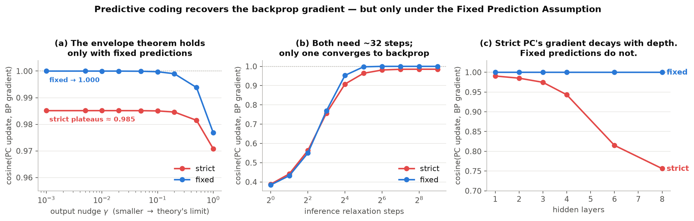

# Predictive coding vs backpropagation

Predictive coding trained without backpropagation, and a measurement of **exactly when its update
equals the backprop gradient and when it does not**.

Three learners, one architecture, one dataset, so the only thing that varies is the credit
assignment rule:

| | how it assigns credit |
|---|---|
| **backprop** | the usual global backward chain — the reference |
| **PC (strict)** | predictions recomputed from the relaxed states each step — predictive coding as the paper specifies it |
| **PC (fixed)** | predictions frozen at their feedforward values — the Fixed Prediction Assumption |

**The headline: only one of the two PC variants actually recovers the backprop gradient, and the
paper specifies the other one.**

---

## 1. Do the gradients match?

Freeze the weights, take one batch, and measure the cosine between the update predictive coding
produces from purely local signals and the gradient backprop would produce. Theory says that as the
output nudge `γ → 0` the cosine should go to 1.

| output nudge γ | PC (strict) | PC (fixed) |
|---|---|---|
| 1.0 | 0.9722 | 0.9779 |
| 0.1 | 0.9858 | 0.9998 |
| 0.01 | 0.9859 | **1.000000** |
| 0.001 | **0.9859 — plateau** | **1.000000** |

Strict PC **never gets there**. Inference is genuinely converged in both cases — the fixed-point
residual falls to `~1e-6` — strict PC simply converges somewhere else, and shrinking `γ` does not
close the gap.

**Why.** At the PC fixed point the hidden-state displacement and the error signal are *both* `O(γ)`.
Relaxing the states perturbs the top-down prediction at the same order as the signal that prediction
is carrying — the signal contaminates its own carrier — so shrinking `γ` shrinks both together and
the ratio never improves. The bias is structural, not a small-nudge artefact. Freezing the
predictions severs exactly that feedback loop, and the recursion collapses onto backprop's.

```bash
make alignment      # ~3 min
```

## 2. Does it matter? Yes — it costs real accuracy

The misalignment is not cosmetic, and it compounds with depth, which is precisely the regime the
whole idea is meant to scale to (MNIST, 20k train, 8 epochs):

| hidden layers | backprop | PC (fixed) | PC (strict) | cos(strict, BP) |
|---|---|---|---|---|
| 1 | 94.34 | 94.18 | 94.86 | 0.991 |
| 2 | 95.60 | 95.26 | 95.32 | 0.986 |
| 3 | 96.40 | 94.68 | 94.70 | 0.973 |
| 4 | 96.28 | 95.22 | 93.42 | 0.943 |
| 6 | 96.62 | **94.28** | **90.78** | **0.811** |

At 8 hidden layers strict PC's update is down to cosine **0.752** with the true gradient. It loses
**3.5 points** to fixed-prediction PC at 6 layers and the gap is still widening. Fixed-prediction PC
stays within ~2 points of backprop at every depth.



```bash
make deep           # ~5 min
```

## 3. What this contradicts

The paper's abstract promises "an envelope theorem proving that predictive coding gradients match
the global objective gradient at convergence". **That holds only under the Fixed Prediction
Assumption**, which the paper never states — it comes from Millidge et al. (2020) §2. Implemented
literally as the paper's §4.2 three-phase loop describes, PC trains on a systematically biased
gradient, and the bias grows with depth.

It is a one-line change:

```bash
python train.py --prediction-mode strict   # cosine 0.752 at 8 layers
python train.py --prediction-mode fixed    # cosine 1.000 at 8 layers
```

## 4. Where to look in the code

If you read three things, read these:

| file | what it is |
|---|---|
| **`influid_pc/pc/core.py`** | the whole algorithm in one class, ~150 lines, mathematics in the docstring, imports nothing else from this repo. **Start here.** |
| **`influid_pc/diagnostics/bp_alignment.py`** | the comparison itself. The backprop reference is a hand-written backward sweep over the same forward equations, so this compares two *learning rules on one model* rather than two models. |
| **`influid_pc/pc/network.py`** | the same algorithm with every edge behind a `Connection`. `train.py` uses this one. |

The strict/fixed switch lives at `pc/core.py:115` and `pc/network.py:74`. The Fixed Prediction
Assumption itself is the two lines at `pc/core.py:125-126` — the predictions and their local
derivatives are computed from the feedforward pass and never see the relaxed states.

**No backpropagation is a property of the code, not a claim in a README.** The linear connections
never call autograd — the update rules are derived by hand — and `tests/test_locality.py` patches
`torch.autograd` to raise an exception, then trains the network to convergence anyway.

---

## How I met the task

> Train PC with different classification (current MNIST 10 class). + Navier-Stokes (fluid dynamics),
> use a dataset other than MNIST with a different class count.

| what was asked | what I ran | result |
|---|---|---|
| PC on a **different classification** than MNIST-10 | MNIST at k = 2, 3, 5, and PC on **EMNIST-Letters, 26 classes** | 99.91 / 99.46 / 98.92, and 72.14 on EMNIST-26 |
| Navier–Stokes on **another dataset, different class count** | **EMNIST-Letters, 26 classes** — every fluid run (in [`other/`](other/)) | 68.98 with transport, 64.82 with transport + HJB |

No Navier–Stokes run uses MNIST, and none uses 10 classes. The 10-class MNIST run is kept only as
the reference point to measure against.

Plain PC, with no fluid and no HJB anywhere in the graph:

| | |
|---|---|
| **MNIST, full 60k, 3 layers, no backprop** | **97.21%** |
| cosine vs. the true backprop gradient, during training | 0.996 – 0.999 |
| parameters / wall clock | 235k / 140s, CPU only |

Across class counts, the comparison is deliberately **biased against PC**: backprop gets the best of
a learning-rate sweep, PC runs at a single fixed setting.

| classes | backprop | PC (no backprop) |
|---|---|---|
| 2 | 99.91 | **99.91** |
| 3 | 99.30 | **99.46** |
| 5 | 99.10 | 98.92 |
| 10 | 96.28 | 95.36 |
| 26 (EMNIST-Letters) | 76.50 | 72.14 |

PC matches or beats backprop at k = 2 and k = 3. The gap widens with class count, and the obvious
explanation for that turns out to be **wrong** — see [docs/FINDINGS.md](docs/FINDINGS.md) §3b, which
records the hypothesis and the sweep that killed it.

## Running it

```bash
uv venv --python 3.12 .venv
uv pip install --python .venv/bin/python -r requirements.txt \
    --extra-index-url https://download.pytorch.org/whl/cpu
```

`make` on its own prints the full list.

```bash
make alignment  # THE COMPARISON: PC vs the true backprop gradient, strict vs fixed  (~3 min)
make deep       # what the misalignment costs in accuracy, at 6 hidden layers        (~5 min)

make classes    # PC across different class counts: 2 / 3 / 5 / 10                   (~4 min)
make emnist     # PC on EMNIST-Letters, 26 classes                                   (~3 min)

make pc         # plain PC, MNIST 10 classes — the starting point                    (~2 min)
make bp         # backprop, given the best of a learning-rate sweep                  (~1 min)

make test       # locality, PC vs backprop, fluid invariants
make figures    # rebuild figures/ from results/
```

Anything without a `make` target runs through `train.py` directly, which takes every component as a
flag (`--prediction-mode`, `--num-classes`, `--output-nudge`, `--fluid`, … — `--help` lists them).

## Documentation

| | |
|---|---|
| **[docs/FINDINGS.md](docs/FINDINGS.md)** | the full argument, with the experiment behind every number |
| **[docs/UNDERSTANDING.md](docs/UNDERSTANDING.md)** | the ideas from first principles, if you want the *why* rather than the result |

## The In-Fluid-Net half

The task also asked for Navier–Stokes, and it is implemented in full — transport as a network layer,
Helmholtz–Hodge projection, HJB regularisation, and the paper's routing task with the baselines it
does not report. It lives in **[`other/`](other/)** with its own README, findings and tests, so that
the result above is not tangled with it.

It is separated because it was not what I presented, not because it is unfinished. It still runs
(`make fluid`, `make routing`) and its invariant suite runs as part of `make test`. `build.py`
imports it lazily, so deleting `other/` leaves a working predictive-coding implementation.

Short version of what is in there: the transport machinery is exact (mass drift `<1e-12`, `div u`
zero by algebraic identity), it **wins decisively at routing** — 54% of the budget delivered vs
0.35% for diffusion — and it is **strictly dominated at classification**, where a plain layer of the
same size beats it 21× faster.

## References

Goertzel, B. *Incompressible-Fluid Networks* (v1, October 2025).
Millidge, B., Tschantz, A., Buckley, C. L. *Predictive Coding Approximates Backprop along Arbitrary
Computation Graphs* (2020) — the Fixed Prediction Assumption is §2.
Whittington, J. C. R., Bogacz, R. *An Approximation of the Error Backpropagation Algorithm in a
Predictive Coding Network with Local Hebbian Synaptic Plasticity* (2017).
