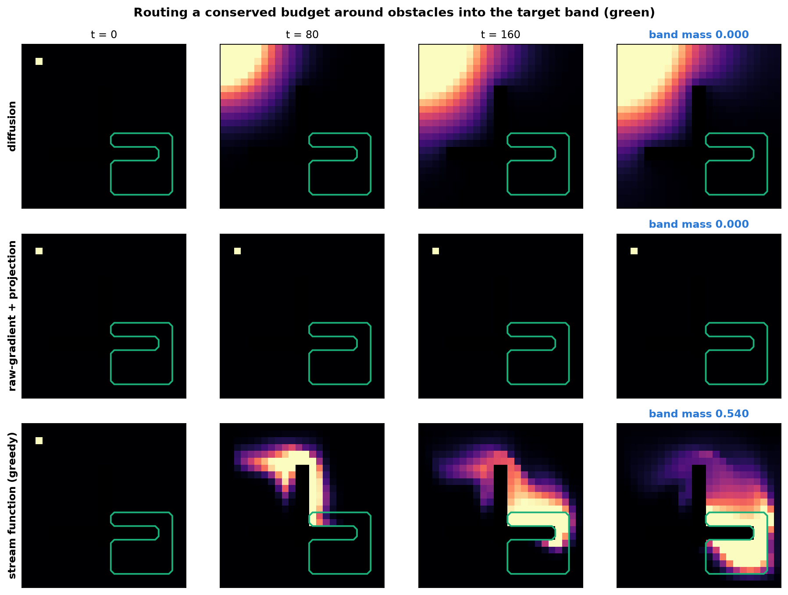

# In-Fluid-PC

Predictive coding trained **without backpropagation**, plus a from-scratch implementation of
*Incompressible-Fluid Networks* (Goertzel, Oct 2025) — incompressible Navier–Stokes transport,
Helmholtz–Hodge projection, and Hamilton–Jacobi–Bellman regularisation — as components you can
switch on and off one at a time.

The point of the layering is that **predictive coding stands alone**. Everything from the paper
is bolted on top of it and can be removed without touching the PC core:

```
influid_pc/
  pc/          predictive coding.          <- the mandatory part. no autograd, no backward chain.
  fluid/       Navier-Stokes transport.    <- remove: --fluid off (the default)
  regularizers/hjb.py                      <- remove: --hjb off (the default)
  regularizers/transport.py                <- remove: --transport-alpha 0 --transport-beta 0
  diagnostics/ the measurements that decide whether any of it works
```

## Headline results

| | |
|---|---|
| **PC on full MNIST, zero backprop** | **97.2%** (3-layer, local Hebbian updates only) |
| **PC update vs. true backprop gradient** | cosine **0.99999** — but only under the Fixed Prediction Assumption |
| **Strict PC at 8 hidden layers** | cosine **0.756** and falling — costing 3.5 points of accuracy |
| **Fluid transport invariants** | mass drift `1e-7`, `div u ≈ 1e-6`, CFL pinned to 0.40, exactly 0 flux into obstacles |
| **Routing task (the paper's §8)** | **54%** of the budget delivered vs **0.05%** for diffusion, **0%** for raw-gradient+projection |
| **Paper's κ=0.3 diffusion warmup** | **harmful for classification** — collapses a linear probe to chance in one step |
| **Fluid layer on EMNIST, capacity-matched** | **loses** to a plain MLP of the same size, at 20× the compute |

Two of these contradict the paper, and one of them is a one-line fix. The detailed argument, with
the experiment behind every number, is in **[docs/FINDINGS.md](docs/FINDINGS.md)** — that is the
document to read.



## Quick start

```bash
uv venv --python 3.12 .venv
uv pip install --python .venv/bin/python torch torchvision matplotlib pytest \
    --index-url https://download.pytorch.org/whl/cpu

# predictive coding alone -- the minimum deliverable
.venv/bin/python train.py --dataset mnist --epochs 10 --train-subset 0 \
    --hidden 256 128 --weight-lr 0.1 --track-alignment

# different class counts (the "different classification" half of the task)
.venv/bin/python train.py --dataset mnist --num-classes 3 --epochs 8

# a different dataset with a different class count, + Navier-Stokes + HJB
.venv/bin/python train.py --dataset emnist_letters --fluid --hjb --epochs 4
```

Everything is verified rather than asserted:

```bash
.venv/bin/python -m pytest tests/ -q          # 14 tests: invariants + PC-vs-backprop
PYTHONPATH=. .venv/bin/python scripts/alignment_study.py
PYTHONPATH=. .venv/bin/python scripts/run_experiments.py
PYTHONPATH=. .venv/bin/python scripts/make_figures.py
```

## What each piece is

**`pc/`** — Predictive coding as literally specified. Each layer holds a state, predicts the layer
above, and computes a local error. Inference relaxes the states; learning is Hebbian
(`ΔW ∝ error × presynaptic activity`). The linear connections **never call autograd** — the update
rules are derived by hand, so "no backpropagation" is a property of the code, not a claim in a
README. `tests/test_pc_vs_backprop.py` checks the hand-written backward reference against autograd,
then checks PC against *that*.

Two inference modes, and the difference between them turns out to matter a great deal:

- `--prediction-mode strict` — top-down predictions are recomputed from the relaxed states each step.
- `--prediction-mode fixed` — predictions are frozen at their feedforward values
  (the *Fixed Prediction Assumption*, Millidge et al. 2020).

**`fluid/`** — The paper's In-Fluid-Net transport layer. Activations become a conserved mass
`ρ ≥ 0, Σρ = 1` on a grid; a learned **stream function** generates a velocity field
`u = ∇⊥ψ` that is divergence-free *by construction*; the mass is advected by conservative
upwind fluxes with CFL targeting. Mass conservation and zero divergence are exact to machine
precision, not approximate — see `tests/test_fluid_invariants.py`.

**`regularizers/hjb.py`** — Stationary Hamilton–Jacobi–Bellman residual
`ν∆W − ½‖∇W‖² − V`, with the running cost `V` taken from the layer's own prediction error, so
the regulariser stays local.

**`diagnostics/`** — The part that keeps everyone honest. `bp_alignment.py` measures the cosine
between the PC update and the true backprop gradient; the fluid layer logs mass drift, `‖div u‖`,
the Courant number, and the fraction of the velocity field that survives projection.

## Removing things

The components are independent, and the defaults are the minimum:

| To drop | Do this |
|---|---|
| Navier–Stokes transport | omit `--fluid` (off by default) |
| HJB regularisation | omit `--hjb` (off by default) |
| Transport regularisers | `--transport-alpha 0 --transport-beta 0` |
| Leray projection | omit `--projection` (off by default; a no-op in stream mode anyway) |
| Everything except PC | `python train.py --dataset mnist` |

Deleting `influid_pc/fluid/` and `influid_pc/regularizers/` leaves a working predictive-coding
implementation, because nothing in `pc/` imports them.
