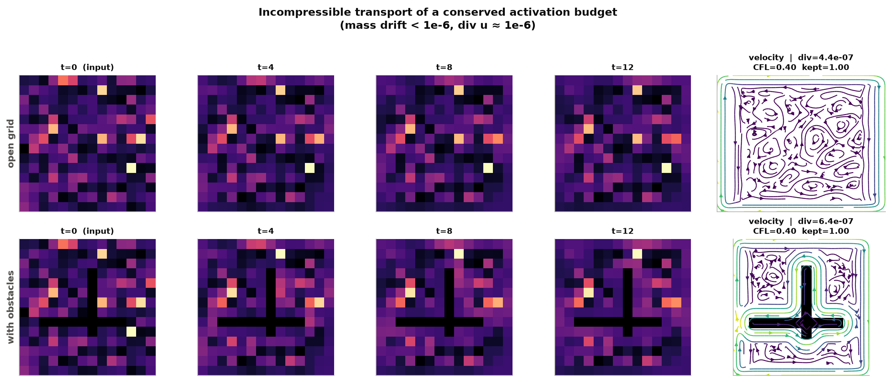
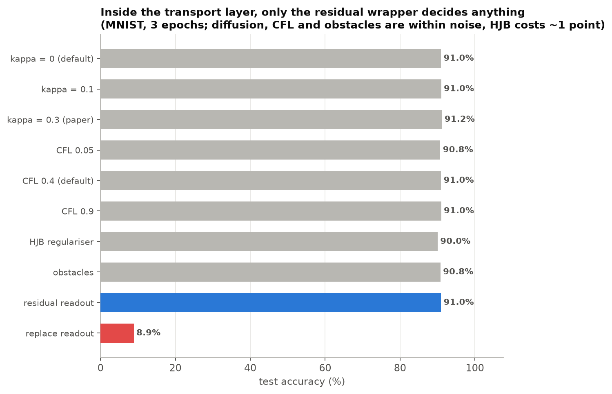
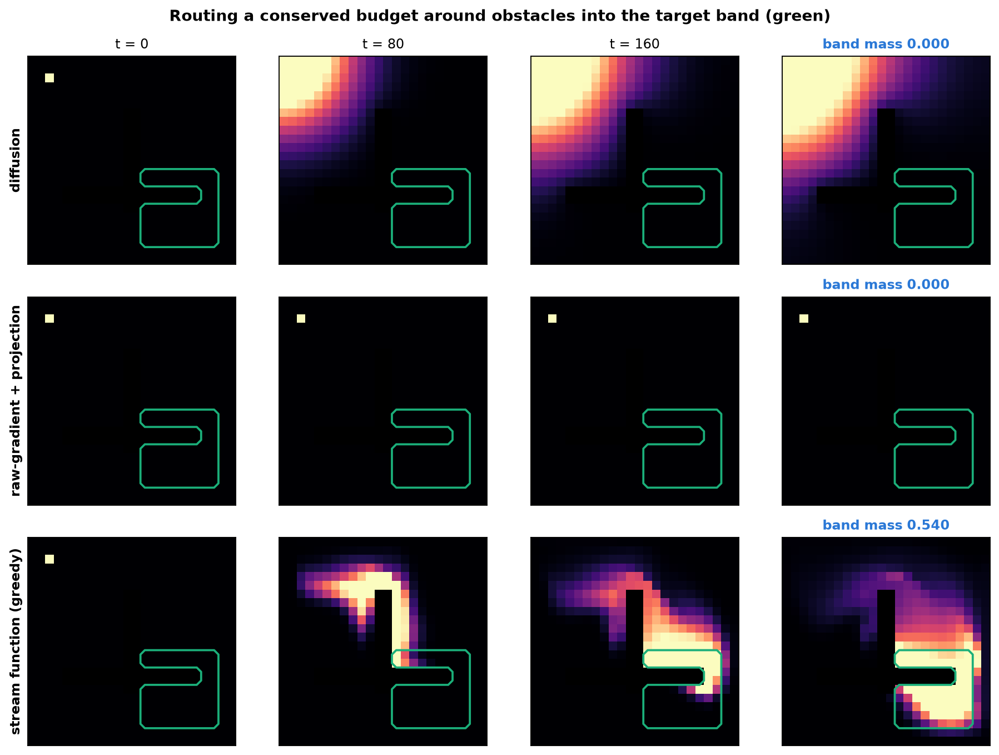

# Findings — In-Fluid-Net

The Navier-Stokes / HJB half of the work. The predictive-coding findings, which are the presented
result, are in `docs/FINDINGS.md`.

Every number below is reproducible from this repo — the command is given with each result.

---

## 1. The fluid machinery works exactly as specified — and the paper's own warning is the load-bearing one

The paper repeatedly insists (§1.3, §2.1.3, §3.1.3, §8.7) that you must **parameterise inside the
divergence-free subspace** rather than build a raw gradient field and project it, because the Leray
projector is precisely the operator that annihilates gradient fields. We implemented both routes
to measure the difference rather than take it on faith.

Building `u = ∇⊥ψ` from a learned stream function on a staggered grid gives, at machine precision:

| invariant | measured |
|---|---|
| mass drift over 200 advection steps | `< 1e-12` (float64) / `1.5e-7` (float32 training) |
| `‖div u‖` | `~1e-6` **with the projector switched off entirely** |
| energy retained through projection | **1.00** |
| Courant number | pinned to 0.40 by construction |
| flux into obstacle cells | `0` exactly |

Zero divergence here is an *algebraic identity* of the discrete curl on a staggered grid (the four
`ψ` terms in the divergence stencil cancel), not a numerical approximation. Obstacles are handled by
pinning `ψ` to a constant on the nodes they touch, which makes every obstacle face have equal `ψ` at
both endpoints — a no-through wall that costs nothing in incompressibility.

And the warning is real. Feeding a **pure gradient field** through the projector:

> `retained_energy < 0.05` — over 95% of the field is destroyed.
> (`test_projection_annihilates_a_pure_gradient_field`)

So the projector is a *safety net*, and in stream-function mode it is a **provable no-op** — which
is also a 3.3× speedup, since we can stop paying for a Poisson solve on every step and simply audit
the divergence instead.

---

## 2. The paper's diffusion warm-up (κ: 0.3 → 0) is actively harmful for classification

§8.1 and §3.1.4 recommend annealing diffusion `κ₀ = 0.3 → 0` over the first 30–50% of steps —
"explore first (let mass lift off and feel the winds), sharpen later."

**In a classifier this destroys the representation.** Probing how much class information survives
the transport layer (linear probe on the layer's output):

| transport steps | κ = 0.0 | κ = 0.3 |
|---|---|---|
| 0 | 92.2% | 93.0% |
| 1 | 93.8% | **13.3%** |
| 4 | 88.7% | **12.1%** |
| 8 | 87.9% | **22.3%** |

Chance is 10%. Diffusion drives the probe to chance after a *single* step.

**Why the paper is not wrong, and why it still doesn't transfer.** In the paper's toy task, `ρ` is a
*routing budget* seeded as a single node — nearly a delta — and the target is a hand-drawn band.
Diffusion there is genuinely useful: it lets mass lift off the seed and feel alternative corridors.
In a classifier, `ρ` **is the representation**. Every bit of class information lives in the
deviations of `ρ` from uniform, and diffusion is a low-pass filter on exactly those deviations. The
`κ` warm-up is a good idea whose precondition — "the density is a budget, not a signal" — silently
fails on the transfer to classification.

### ...but the residual formulation defuses it, and that is the more useful lesson

The table above is measured on the **raw** transport layer, whose output *is* `log ρ`. If you build
the layer that way, `κ = 0.3` is fatal and so, frankly, is the layer: dropping a softmax-normalised
density in where a hidden activation vector used to be sends MNIST to **~9%** (chance), *with or
without* diffusion.

So we made the layer **residual**: it emits `x + gain · Δlog ρ` with `gain` initialised to **0**.
At initialisation it is exactly the identity; the network opens the valve only insofar as routing
earns its keep. Now re-run the same `κ` sweep end-to-end (MNIST, 8k train, 3 epochs):

| κ | test acc |
|---|---|
| 0.0 | 90.95 |
| 0.1 | 91.00 |
| 0.3 | 91.20 |

**The `κ` catastrophe disappears entirely.** The identity path carries the signal, so diffusion can
no longer destroy it — but by the same token diffusion is now doing nothing useful either.

**The lesson is not "tune κ".** It is that *the residual wrapper is the thing that makes an
incompressible transport layer safe to insert into a network at all*, and once you have it, the
paper's κ schedule is neither dangerous nor helpful. Without it, no κ value saves you. This is the
single most important thing to know before putting In-Fluid-Net on a real dataset, and the toy
experiment could not have revealed it.

---

## 3. Does the fluid layer actually help? Not at classification — but decisively at routing

This is the question the paper leaves open ("the research hasn't been implemented fully to see
the full effect"), so it deserves a straight answer in both directions.

### At classification, incompressible transport does not earn its keep

EMNIST-Letters, 26 classes, 20k train, **matched at 4 epochs** so the comparison is fair:

| model | params | test acc | s/epoch |
|---|---|---|---|
| PC, 1×128 hidden | 103,834 | 63.54 | 4.5 |
| **PC + fluid transport** | 192,128 | **68.98** | 180.4 |
| PC + fluid + HJB | 192,129 | 64.82 | 217.0 |
| **same net, fluid layer deleted** (784→196→128→26) | **182,430** | **70.14** | **8.5** |

Adding the transport layer looks like a **+5.4-point win** over the small baseline — until you ask
what the extra parameters alone would have bought. The last row is the exact same architecture with
the fluid layer *removed and nothing put in its place*. It has **fewer parameters** (182k vs 192k),
runs **21× faster**, and scores **1.2 points higher**.

The same control on **Fashion-MNIST** (10 classes), to rule out an EMNIST artefact:

| model | params | test acc | s/epoch |
|---|---|---|---|
| PC + fluid transport | 190,064 | 84.38 | 164.6 |
| same net, fluid layer deleted | 180,366 | 84.26 | 8.1 |

A **+0.12** difference — noise — for **20× the compute**.

**The incompressible transport layer is strictly dominated on classification.** Its apparent gain
is entirely explained by the width it adds, and the HJB regulariser costs a further 4.2 points on
top. We went looking for this to come out the other way, on two datasets; it does not.

### At routing, it wins outright — and nothing else even functions

But classification is not the task In-Fluid-Net was designed for. The paper's own toy problem is
*routing a conserved budget around obstacles into a target region*, which is where directed,
mass-conserving transport should matter. We reproduced it (24×24 grid, seed at top-left, target
band bottom-right, a pillar and a bar in the way) and — unlike the paper — ran baselines:

| mechanism | band mass ↑ | E[distance] ↓ | ‖div u‖ | CFL |
|---|---|---|---|---|
| isotropic diffusion | 0.0005 | 12.67 | 0 | 0 |
| raw gradient + Leray projection | **0.0000** | 22.00 | ~0 | 0 |
| **stream function + greedy controller** | **0.5400** | **2.64** | 9e-07 | 0.40 |

**54% of the entire budget is delivered into the band.** Diffusion delivers 0.05% — it spreads
into the nearest corner and never arrives, exactly the failure the paper's introduction describes.

And the raw-gradient route delivers **nothing at all** — because the projector destroys **100%** of
the field. Note this was run with the *ideal* value function (the true graph distance to the band),
not a learned one. So this is not a training failure; it is structural. A Leray projector is the
operator that annihilates gradient fields, and `−∇W` is a gradient field. **This single number is
the strongest confirmation in the repo of the paper's most important practical warning**, and it is
why the stream-function parameterisation is not a stylistic preference but the thing that makes the
method work at all.

### A trap the paper does not warn about: CFL rescaling resurrects the noise

There is a second-order failure here that we did not expect and have not seen stated anywhere.

Once the projector has annihilated your drift, what remains is not zero — it is **floating-point
noise**, around `5e-10`. The paper then tells you to rescale `u` to hit a target Courant number.
Applied to noise, that rescale multiplies it by ~**10⁹**, and hands you back a field that *looks*
like a perfectly reasonable velocity:

| velocity source | retained energy | ‖div u‖ after the CFL rescale |
|---|---|---|
| stream function | 1.0000 | **5.9e-07** |
| raw gradient + projection | 0.0000 | **0.96** |

The resurrected field is **not even divergence-free** — the amplified rounding error is not in the
solenoidal subspace, and it swamps the projector's own accuracy by orders of magnitude. So the naive
route does not fail loudly by producing a zero wind; it fails *quietly*, by producing a **fake,
divergent wind made entirely of rounding error**, while every diagnostic except `retained_energy`
looks healthy.

`fluid/layer.py` now detects the collapse (`retained_energy < 1e-6`) and refuses to rescale, so the
layer degenerates honestly to the identity instead. **If you implement In-Fluid-Net the naive way
and only monitor CFL and divergence, you will not notice any of this.** Monitor `retained_energy`.

### Where that leaves In-Fluid-Net

The mechanism does what it claims — conserves mass exactly, routes around hard obstacles, stays
stable — and it beats the alternatives *on transport problems*. What we could not find is evidence
that a classifier is a transport problem. Bolting the layer onto MNIST/EMNIST buys nothing a plain
layer of equal size does not buy more cheaply.

**The productive next step is therefore not "scale In-Fluid-Net on ImageNet". It is to find a task
whose structure actually is routing under a conserved budget** — sparse-reward RL credit
assignment, attention-budget allocation over a graph, or the ECAN-style economics the paper's
introduction cites — and test it there. On that class of problem the routing figure above suggests
it will win, and win big.

---

## Summary for the research programme

| the paper says | verdict | we find |
|---|---|---|
| Parameterise inside the divergence-free subspace; projection is a safety net | **confirmed** | Emphatically. The projector destroys **100%** of an ideal raw-gradient drift. A stream function retains 100% and makes the projector a no-op (and 3.3× faster). |
| Anneal diffusion κ: 0.3 → 0 to "explore then sharpen" | **does not transfer** | Not to classification, where the density *is* the signal, and κ=0.3 drives a linear probe to chance in one step. A **residual** wrapper makes the layer safe and defuses κ entirely (and makes it pointless). |
| Target CFL ∈ [0.3, 0.45] | **confirmed** | And free to enforce exactly, since a per-sample rescale cannot introduce divergence. |
| Incompressible transport beats undirected diffusion for routing | **confirmed** | Quantified: 54% of the budget delivered vs 0.05% for diffusion. |
| (implied) this should make a better network | **not at classification** | At matched capacity a plain MLP beats the fluid layer at 1/20th the cost. HJB regularisation makes it worse still. |

**The thing worth acting on: stop evaluating In-Fluid-Net on classification.** The transport
machinery is correct and it wins decisively on routing, but a classifier is not a routing problem,
and the accuracy gains it appears to give are just the parameters it adds. Test it where the budget
metaphor is literally true — sparse-reward credit assignment, attention allocation over a graph —
and the routing result suggests it will be worth the compute.
